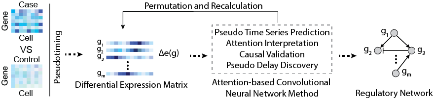

# SIDELINE
The SIngle-cell, DEep-Learning gene regulatory network INferencE (SIDELINE) method is a computational method designed to predict gene regulatory networks (GRNs) using paired datasets of case versus control experiments. After constructing a gene co-differential expression network, SIDELINE employs cell-based pseudotiming, an attention-based convolutional neural network method, and permutation-based significance testing for inferring GRNs among gene modules. 

Corresponding Paper: ADD PAPER LINK HERE 

## Functionality
- Cell- and condition-specific GRN inference from paired scRNA-seq datasets
  - High precision and low false positive rates
  - Highly robust against dropout noise 

## Prerequisites 
### General 
- Python >= 3.5
- [PyTorch](https://pytorch.org/get-started/locally/)
- Optional: CUDA 
### Required Python Packages 
- numpy
- pandas
- random
- heapq
- copy
- os
- sys
- matplotlib
- pylab
- networkx
- argparse
- bambi
- scipy
- scanpy
- time
- arviz
- math
- argparse
- warnings 
- shutil
### Data
Required: Two scRNA-seq datasets, one case and one control
Format: A non-normalized CSV file with genes as rows and cells as columns. **Genes must be in first column of CSV file** 

*Note: Case and control datasets should either be the same cell type and two different experimental conditions OR the same experimental condition and two different cell types* 
##### Sample Datasets 
There are multiple sample datasets under the [Data folder](https://github.com/chenyongrowan/SIDELINE/tree/main/Data). 
1. The [ProstateCancer](https://github.com/chenyongrowan/SIDELINE/tree/main/Data/ProstateCancer)[^1] folder contains datasets for 4 patients. The cells were processed to now contain only endothelial cells. 
2. The [RemoteMemoryFormation](https://github.com/chenyongrowan/SIDELINE/tree/main/Data/RemoteMemoryFormation) folder contains preprocessed datasets from 2 papers. Both datasets contain only neurons. Only fear conditioned (FC) and controls were selected for the [Chen](./Data/RemoteMemoryFormation/Chen)[^2] dataset. The [Rao-Ruiz](https://github.com/chenyongrowan/SIDELINE/tree/main/Data/RemoteMemoryFormation/Rao-Ruiz)[^3] dataset is smaller, demonstrating functionality with a small cell count. 
### Running 
SIDELINE is set up as a single-line command with the following flags: 
**Required flags**
- -goi/--geneOfInterest:  One or more genes of interest. Separate multiple genes with a "+" (ex. Arc+Bdnf)
- -ctrl/--control:        Path to the csv file containing control cells. Provide file with cells as columns and genes as rows. The gene names should be the first column in the file. *The file must contain at least 10 cells*
- -exp/--experimental:    Path to the csv file containing the case cells. Provide file with cells as columns and genes as rows. The gene names should be the first column in the file. *The file must contain at least 10 cells*

**Optional flags**
- -p/--permutations:  Number of permutations to run. Default 100
- -top/--numTopGenes: Number of top correlated genes selected. Default 100
- -zero/--zeroThresh: Threshold for number of 0's tolerated for a gene. Default 0.30
- -s/--start:         Starting point for SIDELINE. Default 1 (Run SIDELINE and background). 2 runs only the background
- --cuda:             CUDA use on when flag included. Leave flag out if using CPU based discovery
- -o/--output:        Output directory name. Default is 'SIDELINE_Output' 

The general command should appear as: 
'''
./runSIDELINE.py -goi Gene1+Gene2+Gene3 -ctrl ./path_to_file -exp ./path_to_file
'''
The optional flags can be added to change default parameters as follows: 
'''
./runSIDELINE.py -goi Gene1+Gene2+Gene3 -ctrl ./path_to_file -exp ./path_to_file -p 50 -top 90 -zero 0.20 --cuda -o NameOfDirectory_Output -s 2
'''
The flags can appear in any order, not just the order detailed here. 

To run a sample dataset from the SIDELINE folder, use the following command: 
'''
./runSIDELINE.py -goi Arc+Bdnf+Mapk4+Erg1 -ctrl ./Data/RemoteMemoryFormation/Chen/mouseNeuron_FCneg.csv -exp ./Data/RemoteMemoryFormation/Chen/mouseNeuron_FCpos.csv -p 50 -top 90 -zero 0.30 -o SIDELINE_SampleDatasetResult 
'''

## Paper
Corresponding Paper (peer-reviewed, open access): ADD PAPER NAME AND LINK 

Please cite this paper when using SIDELINE. 

[^1]: Heidegger, I., Fotakis, G., Offermann, A., Goveia, J., Daum, S., Salcher, S., Noureen, A., Timmer-Bosscha, H., Schäfer, G., Walenkamp, A., Perner, S., Beatovic, A., Moisse, M., Plattner, C., Krogsdam, A., Haybaeck, J., Sopper, S., Thaler, S., Keller, M. A., . . . Pircher, A. (2022). Comprehensive characterization of the prostate tumor microenvironment identifies CXCR4/CXCL12 crosstalk as a novel antiangiogenic therapeutic target in prostate cancer. Molecular Cancer, 21(1), 132. https://doi.org/10.1186/s12943-022-01597-7 
[^2]: Chen, M. B., Jiang, X., Quake, S. R., & Südhof, T. C. (2020). Persistent transcriptional programmes are associated with remote memory. Nature (London), 587(7834), 437-442. https://doi.org/10.1038/s41586-020-2905-5 
[^3]: Rao-Ruiz, P., Couey, J. J., Marcelo, I. M., Bouwkamp, C. G., Slump, D. E., Matos, M. R., van der Loo, R. J., Martins, G. J., van den Hout, M., van, I. W. F., Costa, R. M., van den Oever, M. C., & Kushner, S. A. (2019). Engram-specific transcriptome profiling of contextual memory consolidation. Nat Commun, 10(1), 2232. https://doi.org/10.1038/s41467-019-09960-x 

