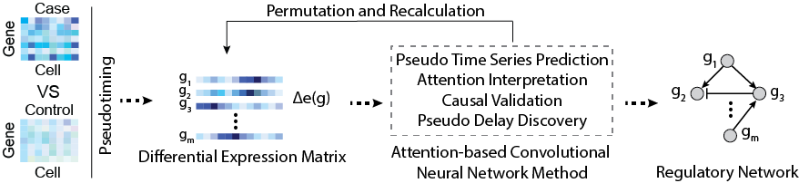

# scTIGER
The **S**ingle-**c**ell **T**emporal **I**nference of **Ge**ne **R**egulatory (scTIGER) Networks method is a computational method designed to predict gene regulatory networks (GRNs) using paired datasets of case versus control experiments. After constructing a gene co-differential expression network, scTIGER employs cell-based pseudotiming, an attention-based convolutional neural network method, and permutation-based significance testing for inferring GRNs among gene modules. 

Corresponding Paper: ADD PAPER LINK HERE 


## Functionality
- Cell- and condition-specific GRN inference from paired scRNA-seq datasets
  - High precision and low false positive rates
  - Highly robust against dropout noise 

## Prerequisites 
### General 
- Python >= 3.5
- [PyTorch](https://pytorch.org/get-started/locally/)
- Optional: CUDA 
### Required Python Packages 
- numpy
- pandas
- random
- heapq
- copy
- os
- sys
- matplotlib
- pylab
- networkx
- argparse
- scipy
- scanpy
- time
- argparse
- warnings 
- shutil
- leidenalg
- torch
- bambi
- math
- arviz
### Data
Required: Two scRNA-seq datasets, one case and one control
Format: A non-normalized CSV file with genes as rows and cells as columns. **Genes must be in first column of CSV file** 

*Note: Case and control datasets should either be the same cell type and two different experimental conditions OR the same experimental condition and two different cell types* 
##### Sample Datasets 
There are multiple sample datasets under the [Data folder](/Data). 
1. The [ProstateCancer](Data/ProstateCancer)[^1] folder contains datasets for one patient. The files were processed to contain only one cell type. They are also separated into benign and tumor cells.  
2. The [RemoteMemoryFormation](/Data/RemoteMemoryFormation) folder contains preprocessed datasets. Datasets contain only neurons. Only fear conditioned (FC) and controls were selected for the [Chen](./Data/RemoteMemoryFormation/Chen)[^2] dataset.
### Running
#### Preprocessing
We have included a file ([10x_preproccess.py](utils/10x_preprocess.py)) to convert the resulting files of a 10x sequencing to the gene expression matrix required for scTIGER. It has a required flag (-d/--directoryPath) which takes the path to a directory with the following files which are output from 10x sequencing: 
- features.tsv.gz
- matrix.tsv.gz
- barcodes.tsv.gz

This script will output the gene expression matrix for those files which can be inputted into scTIGER. 
The command to run this script should follow the following format: 
```
./10x_preprocess.py -d ./Path_to_dir_with_10x_files
```

#### scTIGER
The main folder of this repository contains two main files, [scTIGER.py](/scTIGER.py) which contains the definitions and functions utilized in [run_scTIGER.py](/run_scTIGER.py) which is the script to run scTIGER. 

scTIGER is set up as a single-line command with the following flags: 

**Required flags**
- -goi/--geneOfInterest:  One or more genes of interest. Separate multiple genes with a "+" (ex. Arc+Bdnf)
- -ctrl/--control:        Path to the csv file containing control cells. Provide file with cells as columns and genes as rows. The gene names should be the first column in the file. *The file must contain at least 10 cells*
- -exp/--experimental:    Path to the csv file containing the case cells. Provide file with cells as columns and genes as rows. The gene names should be the first column in the file. *The file must contain at least 10 cells*

**Optional flags**
- -p/--permutations:  Number of permutations to run. Default 100
- -top/--numTopGenes: Number of top correlated genes selected. Default 100
- -zero/--zeroThresh: Threshold for number of 0's tolerated for a gene. Default 0.30
- -t/--timesteps:     Maximum number of steps allowed between interactions. 0 implies a direct, causal interaction. 1 implies one interaction between the source and target gene. Default is 0. 
- -s/--start:         Starting point for scTIGER. Default 1 (Run scTIGER and and generate GRN files). 2 uses existing scTIGER output to generate GRN visualization files if you'd like to change the alpha level. 
- --cuda:             CUDA use on when flag included. Leave flag out if using CPU based discovery
- -o/--output:        Output directory name. Default is 'scTIGER_Output' 
- -a/--alpha:         Alpha value for determining significant gene interactions by scTIGER discovery. Default 0.05

The general command should appear as: 
```
./run_scTIGER.py -goi Gene1+Gene2+Gene3 -ctrl ./path_to_file -exp ./path_to_file
```
The optional flags can be added to change default parameters as follows: 
```
./run_scTIGER.py -goi Gene1+Gene2+Gene3 -ctrl ./path_to_file -exp ./path_to_file -p 50 -top 90 -zero 0.20 -t 1 --cuda -o NameOfDirectory_Output -s 2
```
The flags can appear in any order, not just the order detailed here. 

To run a sample dataset from the scTIGER folder, use the following command: 
```
./run_scTIGER.py -goi AR+PTEN+ERG -ctrl ./Data/ProstateCancer/Patient4_Benign_endothelial.csv -exp ./Data/ProstateCancer/Patient4_Tumor_endothelial.csv -p 50 -top 100 -zero 0.15 -o SampleResult_ProstateCancer
```

We have also included an [Example](/Example) folder which allows users to run the example to make sure their download of scTIGER is functioning. To use it, simply download the scTIGER package, make the Example folder your working directory, and run [./runExample.py](/Example/runExample.py) in your terminal. It will output the [scTIGER_SampleResult_ProstateCancer](/Example/SampleResult_ProstateCancer) directory. 

This directory contains sample output for scTIGER. The main folder contains the raw counts for each gene of interest entered, a .txt file containing the details of the command for later reference, and 3 directories. The [Graphs](/Example/SampleResult_ProstateCancer/Graphs) directory contains histograms displaying the number of interactions detected with a particular percentage recovery as a function of the percent recovery for each gene. The [GRN_Visualization](/Example/SampleResult_ProstateCancer/GRN_Visualization) directory contains the .graphml files for each of the genes of interest which can be opened in your network graphing software of choice. If you do not have a prefrence, we provide information about using Cytoscape below. 

### Visualization 
scTIGER outputs .graphml files for each gene of interest as well as a overall interaction map. You can upload these files to your graphing software of choice. Additionally, we have included our Cytoscape style file ([scTIGER_CytoscapeStyle.json](utils/scTIGER_CytoscapeStyle.json)) for your use. 

The default style on Cytoscape does not show directionality and regulation type (pictured on the left). The scTIGER style automatically adds directionality arrows and displays regulation types as either a T for downregulation or an arrow for upregulation (pictured on the right). 


Information on importing the scTIGER style into Cytoscape can be found [here](https://manual.cytoscape.org/en/stable/Styles.html#styles-tutorials)

## Paper
Corresponding Paper (peer-reviewed, open access): ADD PAPER NAME AND LINK 

Please cite this paper when using scTIGER. 


[^1]: Heidegger, I., Fotakis, G., Offermann, A., Goveia, J., Daum, S., Salcher, S., Noureen, A., Timmer-Bosscha, H., Schäfer, G., Walenkamp, A., Perner, S., Beatovic, A., Moisse, M., Plattner, C., Krogsdam, A., Haybaeck, J., Sopper, S., Thaler, S., Keller, M. A., . . . Pircher, A. (2022). Comprehensive characterization of the prostate tumor microenvironment identifies CXCR4/CXCL12 crosstalk as a novel antiangiogenic therapeutic target in prostate cancer. Molecular Cancer, 21(1), 132. https://doi.org/10.1186/s12943-022-01597-7 
[^2]: Chen, M. B., Jiang, X., Quake, S. R., & Südhof, T. C. (2020). Persistent transcriptional programmes are associated with remote memory. Nature (London), 587(7834), 437-442. https://doi.org/10.1038/s41586-020-2905-5 

